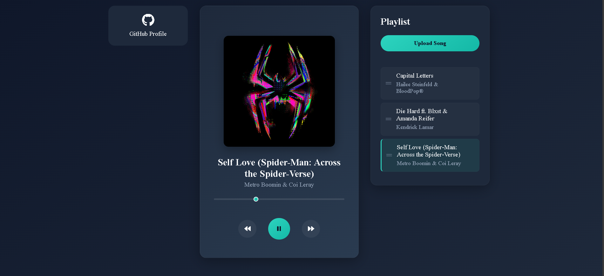

# 🎵 Modern Music Player

A modern and interactive music player built using **JavaScript, HTML, and CSS**. This application allows users to **upload, manage, and play their own music files** while providing an intuitive and responsive user interface.

## 🚀 Features

- 🎼 **Upload and play music** (supports `.mp3`, `.mp4`, and other audio formats)
- 📂 **Manage playlists** (add, remove, and rearrange songs)
- ⏯️ **Playback controls** (play, pause, next, previous, and seek)
- 🎨 **Dynamic UI updates** (track metadata, album art, and animations)
- 🎛 **Interactive progress bar** for song navigation
- 📱 **Responsive design** (works on desktop and mobile)

## 🛠 Technologies Used

- **JavaScript** – Handles playlist management and audio playback.
- **HTML & CSS** – Provides the UI and styling.
- **jsmediatags** – Extracts metadata (title, artist, album art) from audio files.
- **FontAwesome** – Icons for better UX.

## 📸 Screenshots




## 🔧 Setup & Usage

1. Clone the repository:
   ```bash
   git clone https://github.com/little-software-engineer/modern-music-player.git
   ```
2. Open `index.html` in your browser.
3. Click the **Upload Song** button to add music files.
4. Manage your playlist and enjoy the music! 🎶

## 📌 Future Enhancements

- 🎙 **Lyrics display** feature
- Integration with a popular streaming service API

## 🤝 Contributing

Feel free to fork this repository, report issues, or suggest improvements. Contributions are welcome! 😊

## 📄 License

This project is open-source and available under the [MIT License](LICENSE).

